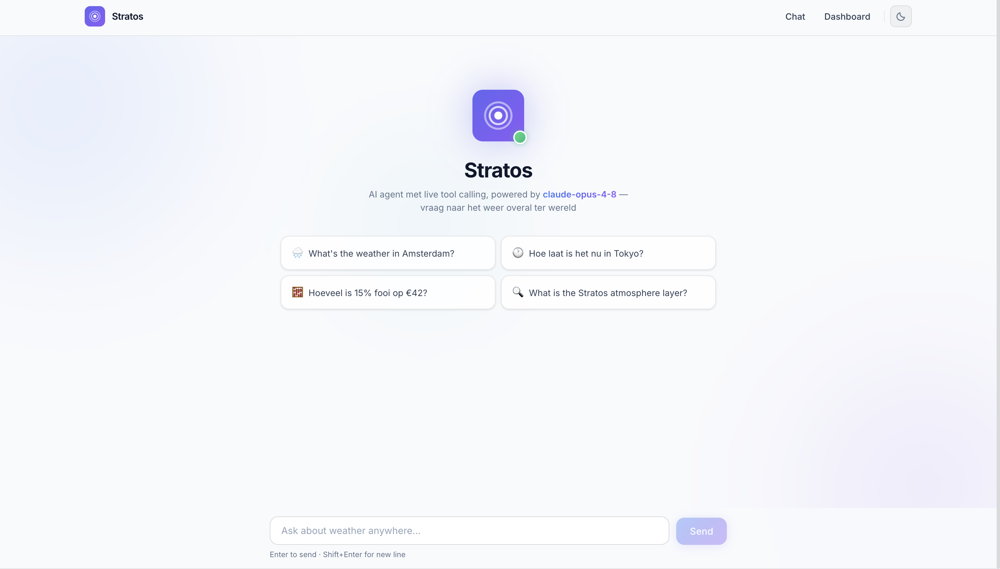
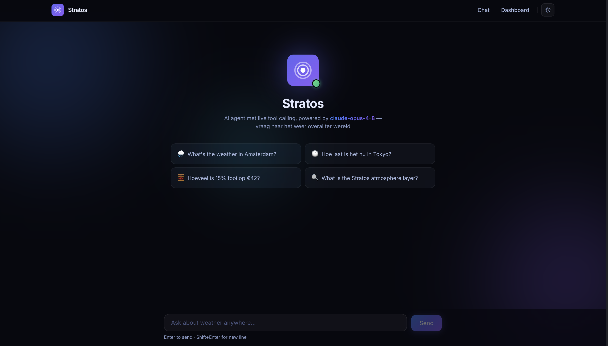
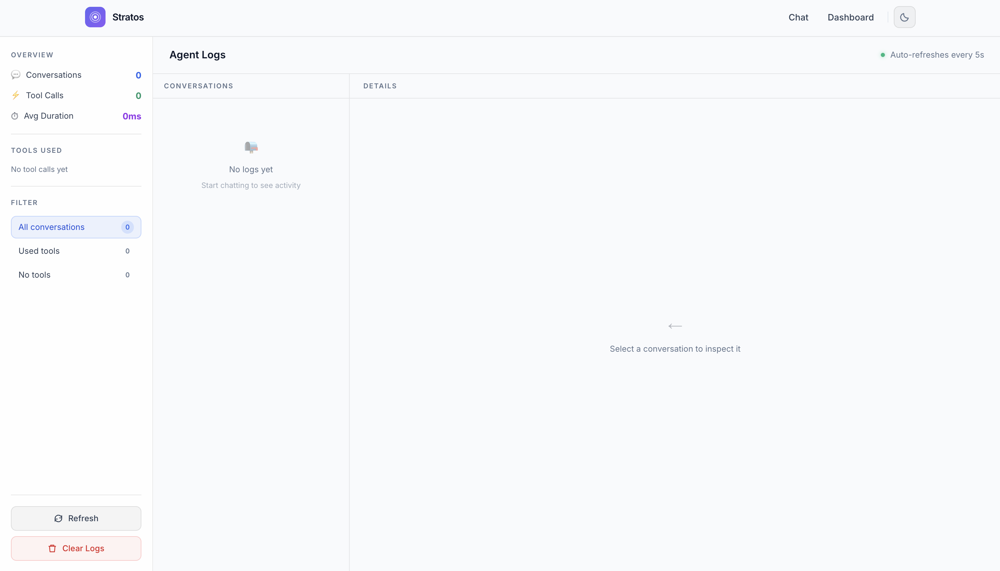
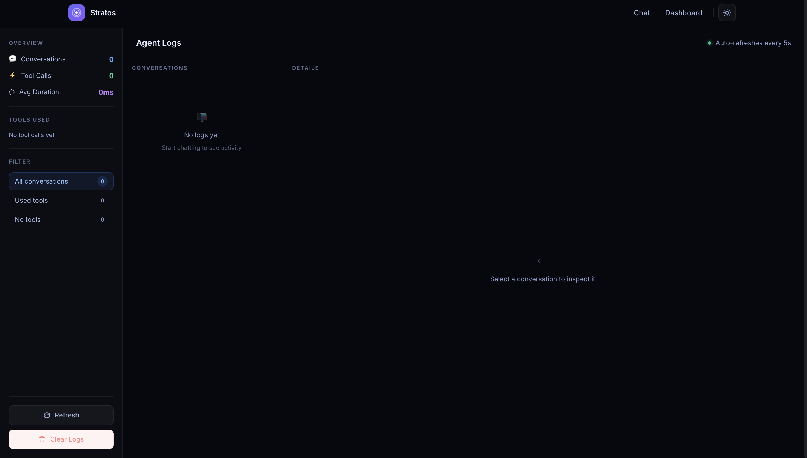

<p align="center">
  <br/>
  <strong style="font-size:2em">Stratos</strong>
</p>

<p align="center">
  AI agent met live tool calling — weer, tijd, rekenen en zoeken, direct vanuit de chat.<br/>
  Gebouwd op Next.js 15 met Claude claude-opus-4-8 en een volledig logs-dashboard.
</p>

<p align="center">
  
  
  
  
  
</p>

---

## Screenshots

### Chat

| Light mode | Dark mode |
|:----------:|:---------:|
|  |  |

### Dashboard

| Light mode | Dark mode |
|:----------:|:---------:|
|  |  |

---

## Features

### Tool calling met agentic loop
De agent gebruikt `claude-opus-4-8` met adaptive thinking. Hij beschikt over vier tools:

| Tool | Wat het doet | Bron |
|------|--------------|------|
| `get_weather` | Actueel weer voor elke stad (temperatuur, wind, beschrijving) | [Open-Meteo](https://open-meteo.com/) — gratis, geen API key |
| `get_time` | Huidige lokale datum & tijd voor elke stad, DST-correct | [Open-Meteo geocoding](https://open-meteo.com/) + [Luxon](https://moment.github.io/luxon/) |
| `calculate` | Wiskundige expressies en eenheden-conversies (`15% * 42`, `5 km to mi`, `37 degC to degF`) | [mathjs](https://mathjs.org/) — geen `eval()` |
| `web_search` | Feitelijke zoekopdrachten (definities, encyclopedische kennis, algemene feiten) | [DuckDuckGo Instant Answers](https://duckduckgo.com/api) — gratis, geen API key |

Bij een vraag roept de agent automatisch de juiste tool(s) aan, bekijkt het resultaat, en beslist of hij meer tools nodig heeft voordat hij antwoordt. De loop draait server-side en ondersteunt tot 10 opeenvolgende tool calls per beurt.

### Logs dashboard
Elke conversatie wordt opgeslagen in een in-memory log en getoond in een driekoloms-layout:
- **Sidebar** — totaaloverzicht (gesprekken, tool calls, gemiddelde duur), tool usage breakdown met progress bars, en filteropties
- **Loglijst** — chronologische lijst met preview van de gebruikersvraag, timestamp en tool-badge
- **Detailpaneel** — volledige weergave met user message, alle tool calls (input + output) en het assistant-antwoord

### Dark / light mode
Systeemvoorkeur wordt gedetecteerd bij het eerste bezoek. De toggle wisselt direct, zonder flash, dankzij een inline script in `<head>` dat voor React-hydration uitvoert. Alle tekstkleuren zijn CSS custom properties:

| Token | Light | Dark | Contrast |
|-------|-------|------|---------|
| `--fg-1` | `#0f172a` | `#E8EEFF` | **17.1 : 1 — WCAG AAA** |
| `--fg-2` | `#334155` | `#A8B8E0` | **9.9 : 1 — WCAG AA** |
| `--fg-3` | `#64748b` | `#8B9CC8` | **4.5 : 1 — WCAG AA** |

### Animated gradient mesh
Het hero-scherm heeft drie langzaam drijvende radial-gradient blobs (blauw, paars, cyaan) als achtergrond, puur via CSS `@keyframes` — geen canvas of JS. In light mode subtiel (13% opacity), in dark mode rijker (26%). De blobs verdwijnen zodra het gesprek begint.

---

## Setup

### Vereisten
- Node.js ≥ 20
- Een [Anthropic API key](https://console.anthropic.com/)

### 1. Omgevingsvariabelen

Maak `.env.local` aan in de projectroot:

```
ANTHROPIC_API_KEY=sk-ant-...
```

### 2. Lokaal draaien

```bash
npm install
npm run dev
# → http://localhost:3000
```

### 3. Docker

```bash
docker compose up --build
# → http://localhost:3000
```

De `ANTHROPIC_API_KEY` wordt pas ingelezen bij het starten van de container — hij wordt **nooit** in de image gebakken.

```bash
docker compose down   # stoppen
```

---

## Projectstructuur

```
app/
  api/
    chat/route.ts       # Agentic loop, tool uitvoering, logging
    logs/route.ts       # GET / DELETE log store
  dashboard/page.tsx    # Logs dashboard met sidebar
  page.tsx              # Chat-interface met gradient hero
  globals.css           # CSS custom properties, glassmorphism, gradient blobs
  layout.tsx            # Nav, ThemeProvider, favicon, no-flash script
components/
  ThemeProvider.tsx     # Theme context + localStorage persistentie
  ThemeToggle.tsx       # Zon / maan knop
lib/
  store.ts              # In-memory log store (globalThis singleton)
  weather.ts            # Open-Meteo geocoding + forecast
  time.ts               # Luxon DST-aware timezone lookup
  calculator.ts         # mathjs safe expression evaluator
  search.ts             # DuckDuckGo Instant Answers API
types/
  index.ts              # Message, ToolCall, LogEntry
public/
  logo.svg              # Stratos logo
docs/
  screenshots/          # chat-light/dark, dashboard-light/dark
Dockerfile              # Multi-stage build (deps → builder → runner)
docker-compose.yml      # Leest ANTHROPIC_API_KEY uit .env.local
```

---

## Tech stack

| Laag | Technologie |
|------|-------------|
| Framework | [Next.js 15](https://nextjs.org/) (App Router, React 19) |
| AI | [Anthropic SDK](https://github.com/anthropics/anthropic-sdk-typescript) · `claude-opus-4-8` |
| Weer & tijd | [Open-Meteo](https://open-meteo.com/) (gratis, geen API key) |
| Rekenen | [mathjs](https://mathjs.org/) — veilig, geen `eval()` |
| Zoeken | [DuckDuckGo Instant Answers](https://duckduckgo.com/api) (gratis, geen API key) |
| Styling | [Tailwind CSS 3](https://tailwindcss.com/) + CSS custom properties |
| Taal | TypeScript 5 |
| Container | Docker multi-stage, `output: 'standalone'`, non-root user |
